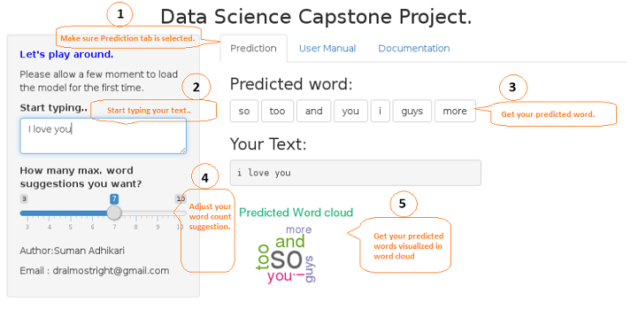

## Introduction
Around the world, people are spending an increasing amount of time on their mobile devices for email, social networking, banking and a whole range of other activities. But typing on mobile devices can be a serious pain. Hence in this Coursera DataScience Specialization Capstone Project I am motivated to address the problem by starting with analyzing a large corpus of text documents to discover the structure in the data and how words are put together, then sampling and building a predictive text model.

This Shiny App is part of Coursera Data Science Specialization: Capstone project which demonstates the deployment of text prediction algorithm.

### Getting Started with Shiny App
The shiny app interface is user friendly and easy to use. Please refer to the follwoing steps for App usage.

1. Click the prediction tab (By default prediction tab will be selected, if not select prediction tab to view result).

2. Type your intput text in textarea below label "Start typing.."

3. With your input the App preprocess the input text and submit to alogrithm which predicts the words and predicted words can be viewed in section "Predicted Word"

4. If you want to adjust your word suggestion count adjust the slider as per your need, min and max count for word suggestion are 3 and 10 respectively.

5. View the predicted words in wordcloud in section below "Your text"

The follwoing picture demonstates the workflow.

---

 

---

Source code  for the complete Project can be found on [GitHub](https://github.com/dralmostright/ds-capstone-project).
