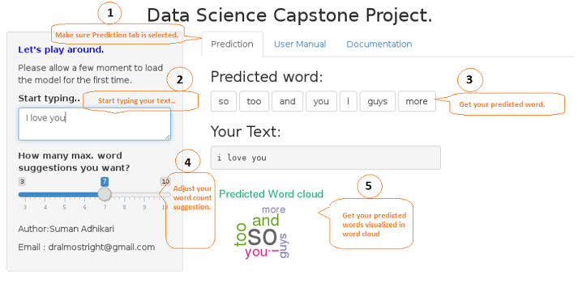

## Getting Started with Shiny App
The shiny app interface is user friendly and easy to use. Please refer to the follwoing steps for App usage.

1. Click the prediction tab (By default prediction tab will be selected, if not select prediction tab to view result).

2. Type your intput text in textarea below label "Start typing.."

3. With your input the App preprocess the input text and submit to alogrithm which predicts the words and predicted words can be viewed in section "Predicted Word"

4. If you want to adjust your word suggestion count adjust the slider as per your need, min and max count for word suggestion are 3 and 10 respectively.

5. View the predicted words in wordcloud in section below "Your text"

The follwoing picture demonstates the workflow.

---

 

---

Source code  for the complete Project can be found on [GitHub](https://github.com/dralmostright/ds-capstone-project).
